## Project Overview
This project analyzes user reviews of ChatGPT collected from the Google Play Store. The data was imported into Snowflake and used for exploratory data analysis (EDA), quality checks, and future modeling tasks.
<br>

## Data Source
The raw dataset was obtained from the Google Play reviews export of the ChatGPT app(Chatgpt_Web_Scraping.ipynb). 

Format: CSV

Size: 100,000 rows

Fields include: review id, user name, review url, review text, star rating(1-5), thumbs up count, timestamps, and app version info.
<br>

## Upload the Data to Snowflake
### Follow the steps below to import the data into Snowflake:
### 1. Create a Table Schema
```sql
CREATE OR REPLACE TABLE chatgpt_reviews (
  REVIEW_ID STRING,
  USER_NAME STRING,
  REVIEW_URL STRING,
  CONTENT STRING,
  SCORE NUMBER,
  THUMBS_UP_COUNT NUMBER,
  REVIEW_CREATED_VERSION STRING,
  REVIEW_TIME TIMESTAMP,
  REPLY_CONTENT STRING,
  REPLIED_AT TIMESTAMP,
  APP_VERSION STRING
); 
```

### 2. Upload File to Stage
In the Snowflake UI, create a named Internal Stage (CHATGPT_REVIEWS_STAGE) and upload the CSV file (chatgpt_reviews_partial_100000.csv).

### 3. Load Data into Table
Use the following COPY INTO command:
```sql
COPY INTO chatgpt_reviews
FROM @CHATGPT_REVIEWS_STAGE/chatgpt_reviews_partial_100000.csv
FILE_FORMAT = (TYPE = 'CSV' FIELD_OPTIONALLY_ENCLOSED_BY = '"' SKIP_HEADER = 1);
```

| Column Name              | Description                        | Type      |
|--------------------------|------------------------------------|-----------|
| `REVIEW_ID`              | Review ID (unique identifier)      | STRING    |
| `USER_NAME`              | Username of the reviewer           | STRING    |
| `REVIEW_URL`             | URL of the review                  | STRING    |
| `CONTENT`                | Text content of the review         | STRING    |
| `SCORE`                  | Star rating (from 1 to 5)          | NUMBER    |
| `THUMBS_UP_COUNT`        | Number of likes                    | NUMBER    |
| `REVIEW_CREATED_VERSION` | App version at the time of review  | STRING    |
| `REVIEW_TIME`            | Timestamp of the review            | TIMESTAMP |
| `REPLY_CONTENT`          | Official reply content             | STRING    |
| `REPLIED_AT`             | Timestamp of the offical reply     | TIMESTAMP |
| `APP_VERSION`            | App version used by the reviewer   | STRING    |


<br>

## Initial EDA & Insights
### 1.Missing Values Overview

The initial data quality check was conducted using SQL count queries for each column in the `chatgpt_reviews` table. The purpose was to identify any fields with missing (`NULL`) values that may impact downstream analysis.

| Column Name        | Non-null Count | Missing Count | Notes                   |
|--------------------|----------------|----------------|------------------------|
| `REVIEW_ID`        | 100,000        | 0              | Fully populated        |
| `CONTENT`          | 100,000        | 0              | Fully populated        |
| `REVIEW_TIME`      | 100,000        | 0              | Fully populated        |
| `USER_NAME`        | 100,000        | 0              | Fully populated        |
| `SCORE`            | 100,000        | 0              | Fully populated        |
| `REPLY_CONTENT`    | 0              | 100,000        | No replies recorded    |
| `REPLIED_AT`       | 0              | 100,000        | No reply timestamps    |
| `APP_VERSION`      | 93,447         | 6,553          | 6.6% values missing    |

### Observations:

- All core review fields such as `review_id`, `content`, `review_time`, `user_name`, and `score` are complete, which indicates good data integrity.
- Fields related to customer support replies (`reply_content`, `replied_at`) are completely missing — indicating no reply activity, so we ignore them in the following analysis.
- Approximately **6.6% of `app_version` values are missing**.

### 2.1 Distribution of reviews by score
| SCORE | FREQ  |
|-------|-------|
| 1     | 6498  |
| 2     | 1749  |
| 3     | 3906  |
| 4     | 9556  |
| 5     | 78291 |

<br>

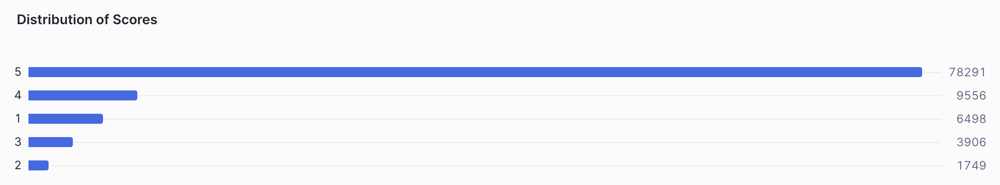

From the table, it shows that reviews with a score of 5 have the most frequency and reviews with a score of 2 have the least frequency. The potential reason why 5-star reviews have the most frequency could be because most people do not find any major drawback of the app or they are not interested in giving detailed review. In order to figure this out, I also calculated the average review length based on scores. 

### 2.2 Average review length by scores
| SCORE | NUM_REVIEWS | AVG_REVIEW_LENGTH |
|-------|-------------|-------------------|
| 1     | 6498        | 72.24             |
| 2     | 1749        | 71.95             |
| 3     | 3906        | 50.60             |
| 4     | 9556        | 36.84             |
| 5     | 78291       | 26.04             |

From the table, it is apparent that reviews with a score of 5 have the least average length, which correspond to my previous hypothesis that users could give a score of 5 simply becasue they are less interested in giving detailed reviews that users who give scores other than 5. In addition, the table indicates that reviews with a low score(1 and 2) tend to have longest review length, which corresponds to the common sense that people are willing to share more feedback if they are not satisfied with something. 

### 2.3 Average number of unique words of reviews based on scores
| SCORE | AVG_UNIQUE_WORDS |
|-------|------------------|
| 1     | 11.57            |
| 2     | 11.48            |
| 3     | 8.36             |
| 4     | 6.38             |
| 5     | 4.72             |
From the table, it is shown that reviews with lower scores tend to have more unique words than reviews with high scores. 


### 3.Descriptive statistics for thumbs-up count: min, max, average, and median
The table shows the minimum, maximum, average and median count of thumbs-ups for all reviews. 

| MIN_THUMBS | MAX_THUMBS | AVG_THUMBS | MEDIAN_THUMBS |
|------------|-------------|------------|----------------|
| 0          | 5608        | 0.281350   | 0.000          |

### 4.Time range of the dataset
| EARLIEST_REVIEW       | LATEST_REVIEW         |
|------------------------|------------------------|
| 2025-07-08 14:27:10.000 | 2025-07-30 00:48:11.000 |


### 5.Daily review count trend over time
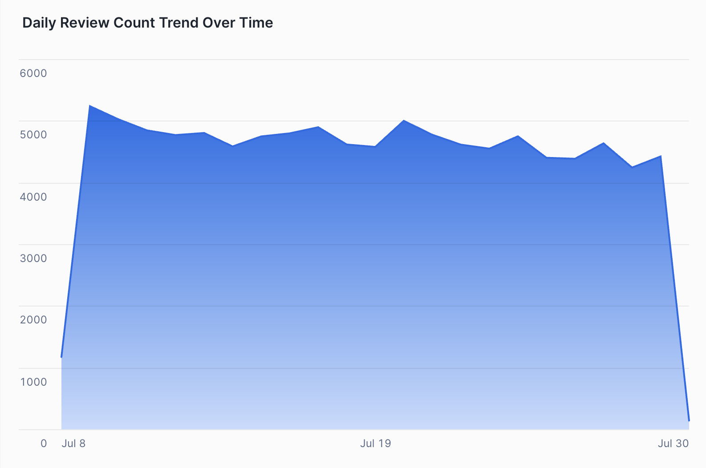
As I scrape the most recent 100000 reviews, it is totally reasonable that there are two low points located at both ends of the graph. It is because that the scraped sample reviews may not include all reviews on those two days. If further analysis needs to be conducted relates to this, we should either ignore the two end-dates or re-collect more comprehensive data. At this stage, we can ignore them. Then, we can tell that the daily review count trend from July 9th to July 29th is generally smooth and average. There are no aggressive up-and-downs. 

### 6.Daily thumbs-up total: shows user engagement trend over time
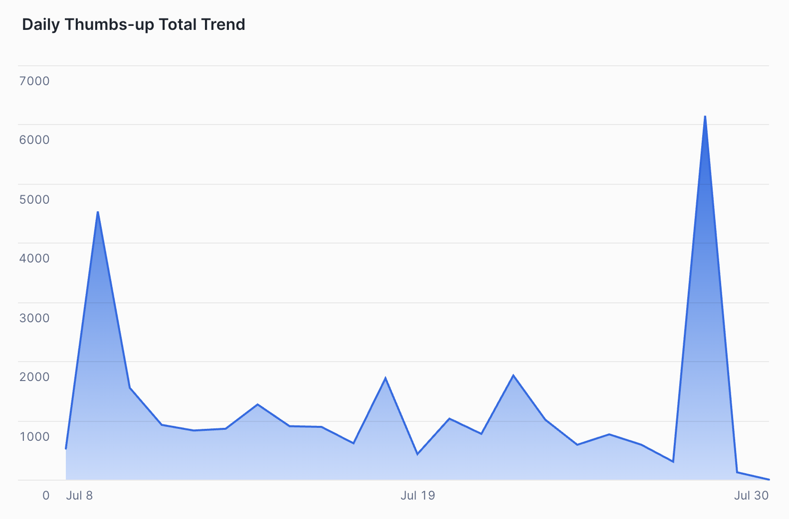
Similar to 4, we can ignore the two end points at this stage. The graph also indicates that there are one peak on July 9th with a total thumbs-up of 4530 and another peak on July 28th with a total thumbs-up of 6146.

### 7.1 Review count per app version
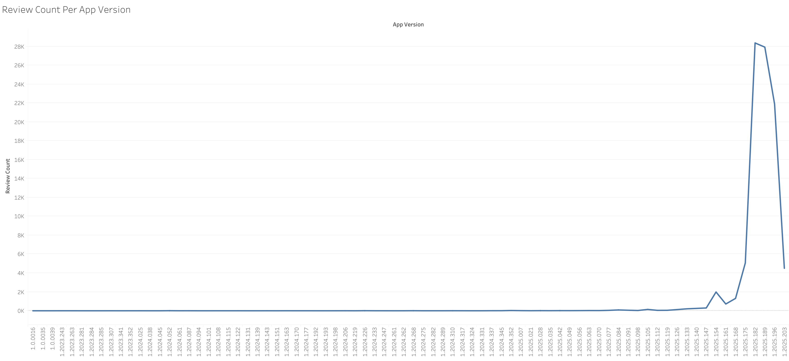
The graph indicates that the most recent versions of app receive most reviews in the sample data. 

### 7.2 Average score by app version (only include versions with >50 reviews)
| APP_VERSION | AVG_SCORE |
|-------------|-----------|
| 1.2025.084  | 4.370787  |
| 1.2025.091  | 4.293103  |
| 1.2025.105  | 4.461538  |
| 1.2025.119  | 4.392157  |
| 1.2025.126  | 4.396825  |
| 1.2025.133  | 4.485577  |
| 1.2025.140  | 4.561265  |
| 1.2025.147  | 4.570470  |
| 1.2025.154  | 4.510050  |
| 1.2025.161  | 4.579387  |
| 1.2025.168  | 4.571973  |
| 1.2025.175  | 4.589339  |
| 1.2025.182  | 4.572365  |
| 1.2025.189  | 4.535379  |
| 1.2025.196  | 4.519529  |
| 1.2025.203  | 4.438374  |

<br>

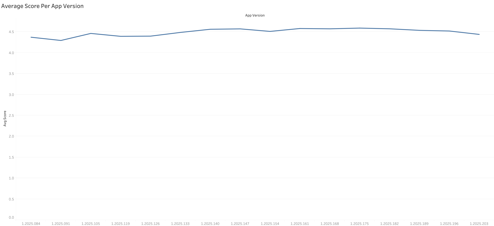
I filtered the app version with at least 50 reviews in order to prevent small sample bias. And the table and graph both shows that this app is generally doing well and receives high rate from users.

### 8.Group reviews by thumbs-up range and calculate average score per group
| THUMBS_RANGE | AVG_SCORE | NUM_REVIEWS |
|--------------|-----------|-------------|
| 0            | 4.549471  | 97996       |
| 1–5          | 2.779174  | 1671        |
| 6–20         | 2.615000  | 200         |
| 20+          | 2.977444  | 133         |
I assign all the reviews into four groups based on how many thumb-up each review receives and calculate their average scores and total count in each group. 

<br>

## Hypothesis Test Regarding Score and Count of Thumb-ups
While exploring the dataset, I noticed an interesting pattern: many low-scoring reviews (e.g., 1-star) had disproportionately high thumbs-up counts. This raised a natural question:

***"Are negative reviews more likely to be "liked" by other users?"***

Although thumbs-up counts and review scores don’t necessarily have a causal relationship, they may still be statistically correlated. To test this, I grouped reviews by their thumbs-up range (0, 1–5, 6–20, 20+) and calculated the average score for each group. The pattern revealed a clear decline in average score as the thumbs-up count increased:
| THUMBS_RANGE | AVG_SCORE | 
|--------------|-----------|
| 0            | 4.549471  | 
| 1–5          | 2.779174  | 
| 6–20         | 2.615000  | 
| 20+          | 2.977444  | 
While the 0 thumbs-up group had the highest average score, these reviews are likely written quickly and casually, with minimal content and limited engagement from other users. Including them could bias the analysis, as their higher scores may not reflect the same level of user attention or interaction. Therefore, the analysis below excludes the `0 thumbs-up` group to focus on more actively engaged reviews.
This motivated me to perform a hypothesis test to assess whether the differences in average scores across these groups are statistically significant. This test helps validate whether the apparent trend is real, or just due to random variation in the data.

### Test Setup

We grouped the reviews into three categories based on thumbs-up count:

- **1–5 thumbs**
- **6–20 thumbs**
- **20+ thumbs**

For each group, we collected the review scores and ran a one-way ANOVA using `scipy.stats.f_oneway()` in Python.
```python
import pandas as pd
from scipy.stats import f_oneway

df = pd.read_csv("Hypothesis_Test_Score_And_Thumb-up.csv")

group_1 = df[df['THUMBS_GROUP'] == '1-5']['SCORE']
group_2 = df[df['THUMBS_GROUP'] == '6-20']['SCORE']
group_3 = df[df['THUMBS_GROUP'] == '20+']['SCORE']

# One-Way ANOVA
f_stat, p_val = f_oneway(group_1, group_2, group_3)
print("F-statistic:", f_stat)
print("p-value:", p_val)
```

### Results

- **F-statistic**: `1.7562`
- **p-value**: `0.1730`

### Interpretation

Since the p-value is greater than the 0.05 significance threshold, we **fail to reject the null hypothesis**. This means that the observed differences in average scores between the three thumbs-up groups are **not statistically significant**. In other words, we cannot conclude that the number of thumbs-up (excluding 0) is associated with systematic changes in review scores.

### Takeaway

While there appears to be a visual trend where more thumbs-up correlates with lower average scores, this trend is **not strong enough to be statistically validated**. It may be the result of random variation in the sample rather than a true difference between the groups.

### Note！！！
This hypothesis test examines whether average scores differ significantly across thumbs-up ranges. It does **not imply a causal relationship** between thumbs-up count and review score. External factors such as review visibility, content richness, or reviewer bias may drive this association.

<br>

## Word Clouds
To better understand how user sentiment is expressed across different levels of satisfaction, we generated separate word clouds for each review score (1 to 5 stars). The goal was to visually identify common themes, concerns, or praises that are specific to each rating level.

### Word Clouds by Score

| 1-Star | 2-Star | 3-Star | 4-Star | 5-Star |
|--------|--------|--------|--------|--------|
|  | 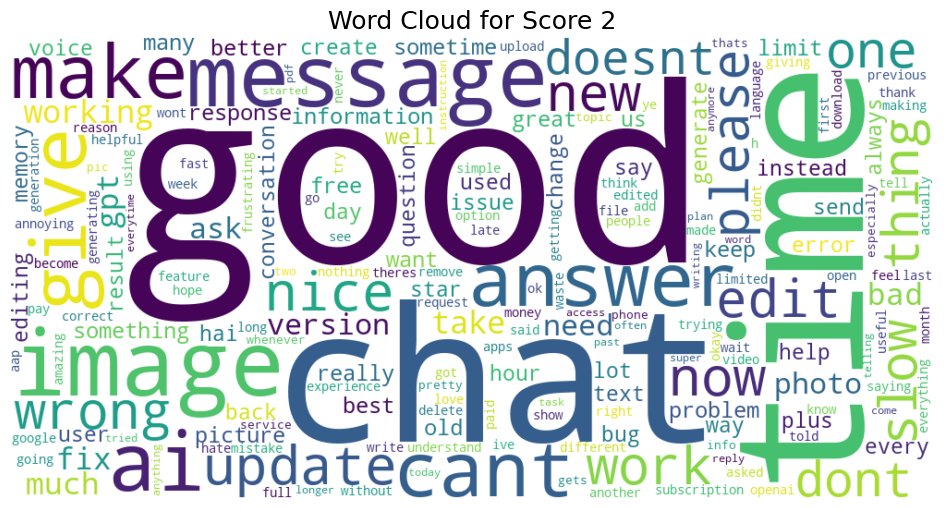 | 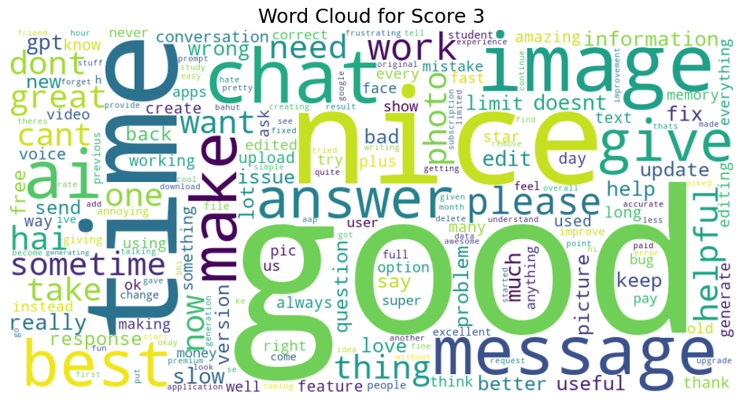 | 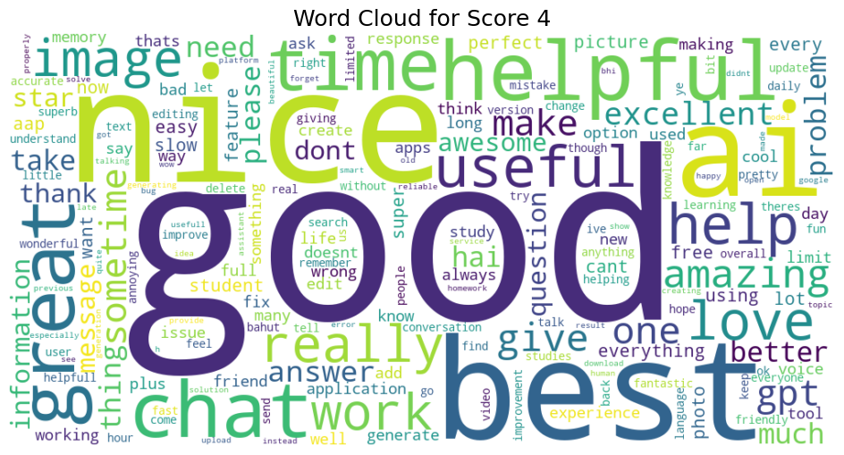 | 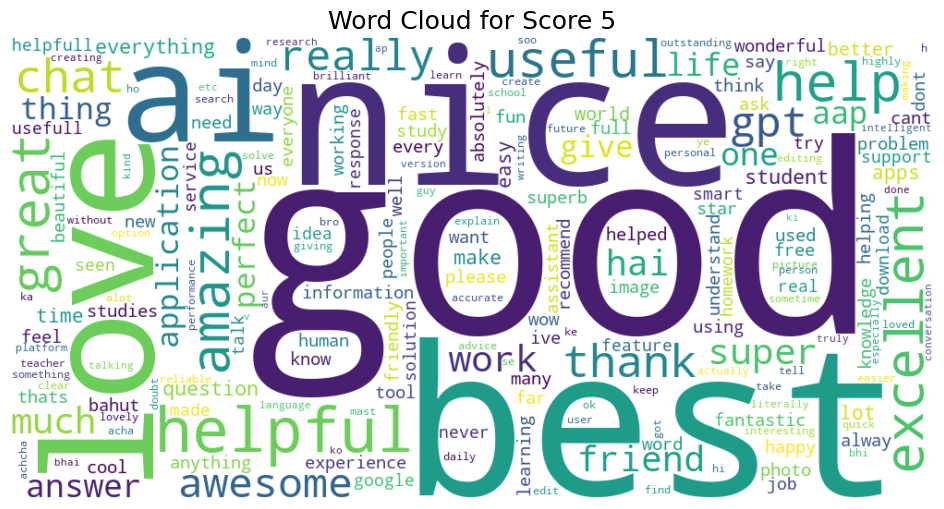 |

<br>

## Emoji
During the early stages of exploratory data analysis, I noticed that a surprisingly large number of reviews consist entirely of emojis (e.g., "😍😍", "👍👍👍", "🔥", etc.), without any accompanying text. While emojis can convey sentiment, they often lack the semantic richness and context required for downstream tasks such as sentiment classification, topic modeling and embedding-based similarity or clustering. 

To assess the scope of this issue, I conducted a focused analysis using Python to detect whether a review contains non-ASCII characters (a proxy for emojis and non-English scripts) and flag reviews that are both extremely short and composed of non-text symbols.
```python
import pandas as pd

df = pd.read_csv("chatgpt_reviews_partial_100000.csv")

df = df[df['content'].notna()]
df['content'] = df['content'].astype(str).str.strip()
df = df[df['content'].str.len() > 0]
def has_non_ascii(text):
    return any(ord(char) > 127 for char in text)

df['has_non_ascii'] = df['content'].apply(has_non_ascii)

non_ascii_ratio = df['has_non_ascii'].mean()
print(f"Percentage of reviews with non-ASCII characters: {non_ascii_ratio:.2%}")

df['content_length'] = df['content'].str.len()
emoji_like = df[(df['has_non_ascii']) & (df['content_length'] < 5)]
print(f"Potential emoji-only or non-informative reviews: {len(emoji_like)}")
```
Through the analysis, I found out that 21.68% of reviews contain non-ASCII characters. Also, I identify those reviews which have a length less than 5 characters and contain non-ASCII characters as non-informative. Among the 100,000 reviews, 2900 of them are identidied as non-informative (potentially emoji-only).

This analysis helps determine whether such reviews should be treated differently during preprocessing (either remove from the set or try to handle them separately with specialized emoji sentiment tools).

<br>

## Conclusion
### Variables and Data Quality Observations Impacting Downstream Usability

Several key insights were identified during the data quality and exploratory analysis stages that may impact the downstream usability of this dataset:

- **Reply fields are entirely missing**: Both `reply_content` and `replied_at` columns have 100% missing values, meaning that no platform responses were captured. These fields will be excluded from all downstream tasks.
  
- **Highly imbalanced score distribution**: The dataset is heavily skewed toward 5-star reviews (~78%), indicating potential challenges for training balanced models or capturing diverse sentiment distributions.

- **Thumbs-up counts are extremely sparse**: Over 97% of reviews have a thumbs-up count of zero. While higher thumbs-up reviews do appear to have slightly lower average scores, our hypothesis test indicates the difference is not statistically significant. The low engagement on most reviews limits the use of this variable as a reliable proxy for review quality.

- **Incomplete app version metadata**: About 6.6% of rows are missing the `app_version` value. For any version-based modeling or trend analysis, these rows will either need to be imputed or excluded.

- **Inconsistent review content quality**: A substantial number of reviews are extremely short, contain repeated or non-informative content (e.g., "Nice", "Great"), or may include emojis or non-English characters. This variability can negatively impact any downstream NLP tasks, including sentiment classification, topic modeling, or embeddings.

- **Non-ASCII characters**: Around 22% of reviews contain non-ASCII characters. A subset of these (2900 reviews) are extremely short and appear to consist only of emojis or symbols. These reviews may need to be excluded from future text modeling tasks due to their lack of semantic content or handled in a separate way.

These insights inform both the limitations and opportunities of the dataset. Further refinement may be required depending on the modeling objectives.


## ChatGPT Google Play Reviews — Product-Centric Analysis

After performing general **EDA (Exploratory Data Analysis)** on the ChatGPT Google Play reviews dataset, it became clear that going further into **product-team-centric insights** was necessary.  
While descriptive EDA (score distributions, correlation with thumbs-up, etc.) helps us understand data quality and user behavior patterns, product managers and developers need **actionable feedback**:  
*What are the main user pain points? How large are they? Which ones should be prioritized for fixes or improvements?*

The following content contains the next step in the analysis pipeline: **automated topic modeling and prioritization of user complaints**, with results written both to Snowflake tables and local CSVs.

**The code is located in Chatgpt_Analysis.ipynb** 

---

## What this analysis does

### 0. Filtering Low-Score Reviews (Pre-Step in Snowflake)

Before running text analysis, I created a **Snowflake view** (e.g., `V_LOW_SCORE_CLEAN`) to filter reviews:

```sql
CREATE OR REPLACE VIEW V_LOW_SCORE_CLEAN AS
SELECT
  REVIEW_ID,
  SCORE,
  THUMBS_UP_COUNT,
  APP_VERSION,
  REVIEW_TIME,
  CONTENT
FROM CHATGPT_REVIEWS
WHERE SCORE <= 2
  AND CONTENT IS NOT NULL
  AND LENGTH(TRIM(CONTENT)) >= 10;
```

- Only keep **low-star reviews (1–2 stars)**.  
- Exclude empty or null text.  

This ensures downstream analysis focuses on **pain points** (review with low scores) instead of generic positive feedback.  


### 1. Text Cleaning
- Keep only predominantly English reviews (In order to be kept, a review need to have its 60% content written in English).  
```python
EN_PROP_MIN      = 0.60

def english_prop(s: str) -> float:
    s = str(s or "")
    letters = sum(ch.isalpha() for ch in s)
    en_letters = sum('a' <= ch.lower() <= 'z' for ch in s)
    return (en_letters / letters) if letters else 0.0
```
- Remove URLs, punctuation, and meaningless tokens.  
```python
CANON_MAP = {
    r"\blog in\b": "login", r"\blogin\b": "login", r"\bsign in\b": "login",
    r"\b2fa\b": "mfa", r"\b2-factor\b": "mfa", r"\b2 factor\b": "mfa",
    r"\bslow\b": "lag", r"\blaggy\b": "lag", r"\blag\b": "lag",
    r"\bprice\b": "pricing", r"\bcharged?\b": "billing",
    r"\brefunds?\b": "refund", r"\bsubscription\b": "subscribe",
    r"\bcrash(es|ed|ing)?\b": "crash",
    r"\bdoesn['’]?t work\b": "not_working",
    r"\bisn['’]?t working\b": "not_working",
    r"\bnot working\b": "not_working",
}

def canon_replace(text: str) -> str:
    t = text
    for pat, rep in CANON_MAP.items(): t = re.sub(pat, rep, t)
    return t

def clean_text(s: str) -> str:
    t = str(s or "").lower()
    t = re.sub(r"http\S+|www\S+", " ", t)         # Get rid of URL
    t = canon_replace(t)                          # Treat similar words as the same one
    t = re.sub(r"[^a-z0-9\s']", " ", t)           # Only English letter, numbers, space and comma
    t = re.sub(r"\s+", " ", t).strip()
    return t
```

- Discard overly short reviews (len < 10).  
```python
df = df[df["text_clean"].str.len() >= 10]
```
Steps above ensure that the text going into the model is clean and comparable.

---

### 2. Vectorization (TF-IDF)
- Convert reviews into numerical vectors with **TF-IDF weighting**.  
  - TF (Term Frequency): The more frequently a word appears in a review, the more important it is within that review.
  - IDF (Inverse Document Frequency): The rarer a word is across all reviews, the more it helps distinguish topics, thus giving it a higher weight.
- Use **1–3 grams** (single words, bigrams, trigrams) so phrases like “login issue” or “unable to connect” are captured.  
  - For example, a reviews is `"App runs slow."` By using **1–3 grams**, we would get "App", "runs", "slow", "App runs", "runs slow", "App runs slow".
- Apply **noise filters**:  
  - `min_df=12`: Remove extremely rare typos/noise. It indicates that a word needs to be presented in at least 12 reviews to be kept.
  - `max_df=0.40`: Remove overly common words that don’t help (e.g., “app”, “please”). It indicates that if a word show in greater than 40% of reviews, we would drop it.
  - Stop words (general + domain-specific).
    ```python
    DOMAIN_STOP = {
        "app","apps","chatgpt","openai","ai","gpt","version","versions","update","updated",
        "fix","fixed","issue","issues","problem","problems","bug","bugs","please","pls",
        "thanks","thank","hi","hello","team","dear","experience","experiences",
        "nice","good","bad","very","best","worst","useful","useless","helpful","not",
        "really","actually","also","ever","always","never","still","just","well","ok",
        "work","works","working","worked","proper","properly","application"
    }
    STOP_WORDS = list(sk_text.ENGLISH_STOP_WORDS.union(DOMAIN_STOP))
    ```

TF-IDF vectorization produces a sparse matrix where each review is represented by its most informative terms. Each review now becomes a vector. 

---

### 3. Topic Modeling (NMF with Automatic K Selection)
- Let's call the matrix we get from the TF-IDF vectorization `X`. It looks like below:
- #### TF-IDF = TF × IDF (example)

  | Reviews/Words   | charged | freezing | login | password | refund | reset | slow |
  |-----------|---------|----------|-------|----------|--------|-------|------|
  | **Review1**    | 0       | 0        | 0.693 | 0        | 0      | 0     | 0    |
  | **Review2**    | 0       | 0        | 0.693 | 1.386    | 0      | 1.386 | 0    |
  | **Review3**    | 0       | 1.386    | 0     | 0        | 0      | 0     | 1.386|
  | **Review4**    | 1.386   | 0        | 0     | 0        | 1.386  | 0     | 0    |

- Use **Non-Negative Matrix Factorization (NMF)** to decompose reviews into **topics**.
  -  Decomposition: `X` = `W` * `H` 
  - The matrix `W` refers to Reviews × Topic Strength, how strongly each review belongs to each topic.  
  - The degree of match between each review and each topic. For example, the 5th review has a strength of 0.8 on the “login issues” topic, but only 0.1 on the“performance slowdown” topic. It looks like below:

    | Reviews/Topics             | Topic0 (Login/Auth) | Topic1 (Performance) | Topic2 (Billing) |
    |------------------|---------------------|-----------------------|------------------|
    | **R1 “cannot login”**      | **0.90**              | 0.00                  | 0.00             |
    | **R2 “login password reset”** | **0.85**              | 0.00                  | 0.00             |
    | **R3 “slow freezing”**     | 0.00                  | **0.95**              | 0.00             |
    | **R4 “charged refund”**    | 0.00                  | 0.00                  | **0.92**         |
  
  - The matrix `H` refers to Topics × Word Weights, which words characterize each topic.
  - Shows the most representative words for each topic. For example, in the “login issues” topic, the weights of login / password / cannot / reset are relatively high. It looks like below: 

    | Topics/Words                   | charged | freezing | login | password | refund | reset | slow |
    |------------------------|---------|----------|-------|----------|--------|-------|------|
    | **Topic0 (Login/Auth)** | 0.00    | 0.00     | **0.80** | **0.70**   | 0.00   | **0.65** | 0.00 |
    | **Topic1 (Performance)** | 0.00    | **0.75** | 0.00  | 0.00     | 0.00   | 0.00  | **0.78** |
    | **Topic2 (Billing)**    | **0.82** | 0.00     | 0.00  | 0.00     | **0.80** | 0.00  | 0.00 |

- For each K (number of topics), there would be a unique combination of `W` and `H`. The system automatically selects the number of topics (K) in range 6–12 by scores, which are calculated based on different `H`. 
- There are two metrics for score calculating: 
  - **Independence**: topics should be distinct.  
  - **Sparsity**: each topic should have a few sharp keywords, not a vague range of words. 
  ```python   
  def score_topics(H):
      sim = cosine_similarity(H)            # Independence: we want this to be small (similarity between different topics should be small)
      np.fill_diagonal(sim, 0.0)
      inter_sim = sim.mean()
      sparsity = (H < (H.mean(axis=1, keepdims=True))).mean()  # Sparsity: we want this to be large (the fewer words that can represent a topic, the better)
      return (1 - inter_sim) * 0.6 + sparsity * 0.4        # score which serves as proof to determine which K should we choose

  def fit_nmf_with_best_k(X):
      best = None
      for k in K_RANGE:
          nmf = NMF(n_components=k, init="nndsvda", random_state=42, max_iter=400)
          W = nmf.fit_transform(X); H = nmf.components_          #
          s = score_topics(H)
          if (best is None) or (s > best["score"]): best = {"k": k, "model": nmf, "W": W, "H": H, "score": s}
      return best
  ```
The combination of `W` and `H` with the greatest score will be choosen. At that moment, K is determined. 
Steps above automatically discover themes like *Login Issues*, *Performance Lag*, *Billing Problems*, etc.

---

### 4. Topic Keywords and Naming (shown in the topics_keywords_.csv)
- Extract top keywords from each topic (only English).  
```python
def _is_english_phrase(s: str) -> bool:
    return bool(re.fullmatch(r"[A-Za-z]+(?: [A-Za-z]+)*", s or ""))
```

- Apply simple **rule-based mapping** to auto-name topics:  
  - If keywords include login/password → **Login / Account**  
  - If billing/payment/refund → **Billing / Subscription**  
  - Otherwise, fallback to top 3 keywords.  
```python
NAME_RULES = [
    ("Login / Account",     ["login","account","password","otp","mfa","verification"]),
    ("Billing / Subscription",["billing","subscribe","payment","pricing","refund","charge"]),
    ("Performance / Crash", ["lag","slow","freeze","loading","crash","latency"]),
    ("Answer Quality",      ["answer","response","quality","accuracy","wrong","hallucination"]),
    ("Access / Region",     ["region","country","available","access","blocked","unsupported"]),
    ("UI / Usability",      ["ui","ux","button","menu","dark mode","layout"]),
]

def auto_name(keywords: list[str]) -> str:
    kw_join = " ".join(keywords)
    for name, needles in NAME_RULES:
        if any(n in kw_join for n in needles): return name
    eng = [w for w in keywords if _is_english_phrase(w)]
    return ", ".join(eng[:3]).title() if eng else "General"
```
Steps above give PMs an easy-to-read label for each theme without diving into raw keywords.

---

### 5. Representative Reviews (shown in the topics_example_.csv)
- Each review is assigned to its strongest topic.  
- For each review, compute a **representative score**:  
$$
\text{representative score} = \text{topic strength} \times \log(\text{thumbs-up}+1)
$$
- Representative scores balance *how typical* the review is of the theme and *how many users agree*. 
- After representative scores are calculated, there are 2 additional steps to finizalize the representative reviews: 
  - Remove near-duplicates **(Jaccard similarity)**.  
  - Apply **MMR (Maximal Marginal Relevance)** to select **Top 5 diverse examples per topic**.  

Steps above provide PMs with “golden sample” reviews: both representative and varied.

---

### 6. Topic Summary (PM Dashboard View, shown in the topics_summary_.csv)
- For each topic, compute:  
  - **share_pct**: percentage of reviews belonging to this topic.  
  - **thumbs_avg / thumbs_median**: average and median thumbs-up count.  
  - **sample_size**: number of reviews in this topic.  
- Output a **summary table**, sorted by topic number.  

Acts as a **quantitative view** for prioritization:  
- *Large share + high thumbs-up* = major pain point, high priority.  
- *Smaller share but extreme thumbs-up* = niche but critical issue.

---

## Outputs
Each run generates three result tables (written to both CSV and Snowflake):  

1. **`topics_keywords`** → Top keywords + assigned topic name.  
2. **`topics_examples`** → Representative sample reviews per topic.  
3. **`topics_summary`** → Aggregated stats per topic for prioritization.  


### Snowflake vs Local CSV Outputs

Our pipeline produces results in **two destinations**:  

- **Local CSVs**:  
  - `topics_keywords_<timestamp>.csv`  
  - `topics_examples_<timestamp>.csv`  
  - `topics_summary_<timestamp>.csv`  
  - Each run generates a fresh set of CSV files with a unique timestamp (e.g., `20250817_143015`).  
  - CSVs are useful for **quick offline review** or sharing snapshots.

- **Snowflake Tables**:  
  - `TOPICS_KEYWORDS`  
  - `TOPICS_EXAMPLES`  
  - `TOPICS_SUMMARY`  
  - Each table includes an extra column: **`run_at`**, automatically populated with the current timestamp when rows are inserted.  
  - This `run_at` column enables us to distinguish **which rows belong to which run**.  

---

### Daily Update Logic

Before inserting new rows, the pipeline executes:

```sql
DELETE FROM <table>
WHERE DATE(run_at) = CURRENT_DATE();
```
- This ensures that only today’s old rows are cleared before writing fresh results. Runs from previous days are preserved, so the tables naturally accumulate a daily history of topic modeling outputs.
- If you re-run the pipeline multiple times on the same day, the day’s data will be replaced with the latest results.
- If you run it tomorrow, new rows for that date will be appended, while yesterday’s rows remain intact.

### Thoughts behind why I make Snowflake output different from CSV(local) output
This design makes it possible to:
- Build an automated daily pipeline in the future.
- Query topic trends over time (e.g., “compare Login issues between 08-16 and 08-17”).
- Keep a full historical archive without manual file management.

### Example Timeline

| Date   | Run # | CSV Output                         | Snowflake Output                                         |
|--------|-------|------------------------------------|----------------------------------------------------------|
| 08-16  | 1     | `topics_*_20250816_10150.csv`      | Rows with `run_at = 2025-08-16`                          |
| 08-17  | 1     | `topics_*_20250817_09020.csv`      | Rows with `run_at = 2025-08-17` appended (08-16 history remains)  |
| 08-17  | 2     | `topics_*_20250817_12100.csv`      | Old `08-17` rows deleted, replaced with latest           |
| 08-17  | 3     | `topics_*_20250817_18300.csv`      | Old `08-17` rows deleted, replaced with latest           |
| 08-18  | 1     | `topics_*_20250818_08350.csv`      | Rows with `run_at = 2025-08-18` appended (08-16 & 08-17 history remain) |


### A Brief View of How Outputs look like (CSV)
`topics_keywords_<timestamp>.csv`  

- 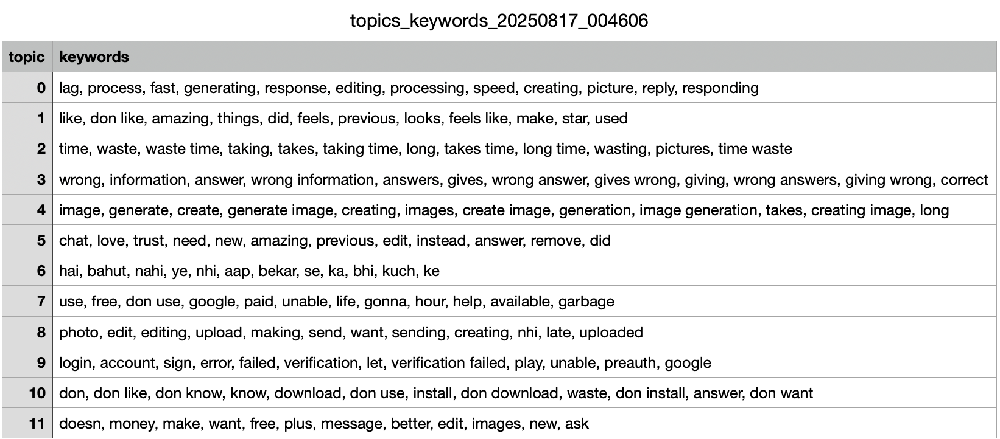

`topics_examples_<timestamp>.csv` 

- 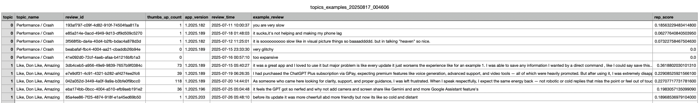

`topics_summary_<timestamp>.csv`  

- 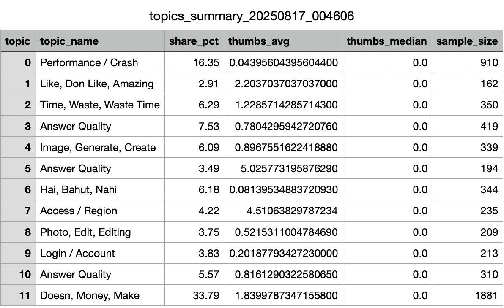

---

## Value to Product Team
This analysis transforms thousands of free-text reviews into a structured dashboard of **pain points, representative examples, and quantitative impact measures**.  
It enables product managers to:  
- Quickly see what issues matter most.  
- Validate fixes against user feedback.  
- Prioritize roadmap decisions with data-driven evidence.  

---

## Pipeline Overview

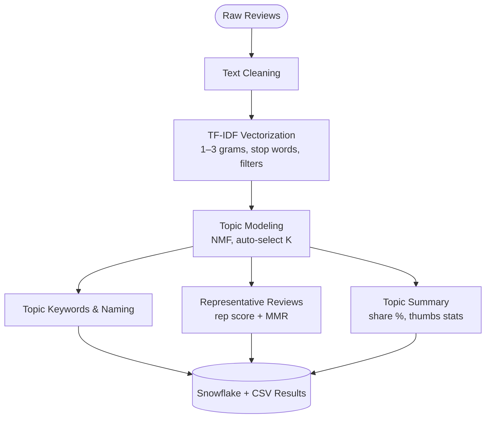

## Adjustable Parameter Chart from the Python File (where you can adjust): 

EN_PROP_MIN：English Proportion(default 0.60).

MIN_DF / MAX_DF / MAX_FEATURES：Control the vocabulary size and filtering strength for TF-IDF.

K_RANGE：The range for automatically selecting K.

TOPN_WORDS：Number of keywords displayed per topic.

EXAMPLES_PER_TP：Number of representative reviews selected per topic.

MMR_LAMBDA、DEDUP_JACCARD：Diversity and deduplication strength of representative reviews.

DOMAIN_STOP：Domain-specific stopwords; add filler/noise words here when discovered.


